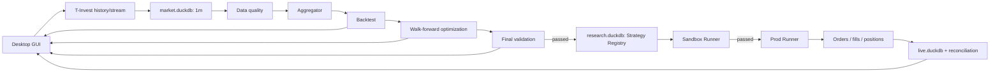

# Система разработки и эксплуатации торговых роботов на T‑Инвестициях

Статус: concept / architecture baseline  
Дата актуализации концепта: 2026-09-30

## 1. Scope первой версии

Первая версия сознательно ограничена, чтобы быстрее получить воспроизводимый research → validation → live pipeline:

- брокер и источник данных: **T‑Инвестиции**;
- один алгоритм стратегии: `GrowthTrendV1`;
- только long;
- около **10 акций**;
- история: **5 лет минутных свечей 1m**;
- старшие таймфреймы строятся локально из 1m;
- локальное хранилище: **DuckDB**;
- **desktop GUI без web frontend / web server**;
- без микросервисов и отдельного серверного DB-кластера.

При таком scope разумнее оптимизировать систему на простоту, воспроизводимость исследований и одинаковую логику backtest/live, а не на горизонтальное масштабирование.

## 2. Цель

Создать воспроизводимую систему, которая:

1. собирает и хранит минутные свечи из T‑Invest API;
2. строит из минутных свечей произвольные минутные и часовые таймфреймы;
3. подбирает параметры `GrowthTrendV1` отдельно для выбранных инструментов или общей конфигурации;
4. проверяет найденные параметры на данных, которые не участвовали в подборе;
5. запускает прошедшие проверку конфигурации сначала в sandbox, затем в реальной торговле;
6. использует одну и ту же бизнес-логику сигналов в backtest, validation, sandbox и prod;
7. предоставляет все основные пользовательские сценарии через локальное desktop-приложение.

Ключевая цель — не максимальная доходность на истории, а **устойчивость результата вне обучающего периода**.

> Система может снижать риск переобучения и ошибок исполнения, но не может гарантировать прибыль или стабильный финансовый результат на будущих данных.

## 3. Оценка объема данных

Для 10 акций и 5 лет истории ожидаемый порядок величины — примерно **8–15 млн строк 1m-свечей**, в зависимости от длительности торговых сессий и фактического количества доступных свечей.

Даже с запасом этот объем хорошо соответствует локальному аналитическому сценарию DuckDB:

- последовательная загрузка истории;
- columnar scans;
- агрегации по времени;
- выборки диапазонов для backtest;
- аналитические запросы по нескольким миллионам строк;
- отсутствие необходимости поддерживать отдельный DB-сервер.

Целевой operational budget для MVP: десятки миллионов строк свечей и несколько гигабайт локальных данных с запасом на агрегаты, эксперименты и индексы/метаданные.

## 4. Основные архитектурные решения

- Канонический источник исторических market data внутри проекта — локальные **закрытые свечи 1m**.
- Все старшие таймфреймы строятся из локальных 1m одинаковым агрегатором.
- Время хранится в UTC; торговая сессия и локальное биржевое время являются производными атрибутами.
- Исследования используют только завершенные свечи.
- Сигнал рассчитывается после закрытия бара; сделка в backtest моделируется не раньше следующего доступного бара.
- Оптимизация выполняется только на training/walk-forward данных.
- Финальный holdout не используется для выбора параметров.
- Комиссии, проскальзывание, задержка исполнения и лотность учитываются до допуска стратегии к live.
- Live-торговля имеет отдельный слой risk checks и reconciliation с брокером.
- Все результаты экспериментов сохраняются с версией данных, кода и конфигурации.
- Для MVP используется **DuckDB без Alembic/SQLAlchemy**. Схема создается и мигрируется собственными versioned SQL migrations.
- Пользовательский интерфейс — **PySide6/Qt desktop application**; HTTP API, localhost server и browser UI отсутствуют.
- Длительные задачи выполняются вне UI thread; тяжелые backtest/optimization — в worker processes.
- T‑Invest token хранится через системное credential/keychain storage, а не в DuckDB или config-файле.

## 5. DuckDB layout

Чтобы тяжелые исследования не конфликтовали с live-записью, используется несколько файлов одной технологии:

```text
data/
├── market.duckdb      # instruments, raw 1m candles, aggregated candles, dataset metadata
├── research.duckdb    # experiments, trials, metrics, validation results, strategy registry
└── live.duckdb        # orders, fills, positions, decisions, reconciliation, runtime state
```

Правило владения:

- `data-worker` — единственный writer в `market.duckdb`;
- research-процессы читают `market.duckdb` преимущественно read-only;
- coordinator оптимизации — writer в `research.duckdb`;
- `live-runner` — единственный writer в `live.duckdb`;
- тяжелая оптимизация никогда не выполняется внутри `live-runner`.

Это важнее, чем пытаться использовать один общий DuckDB-файл для всех процессов.

## 6. Предлагаемый стек MVP

- Python 3.12+
- T‑Invest Python SDK: `t-tech-investments`
- **DuckDB**
- Polars + Arrow для batch analytics и передачи данных в backtest
- NumPy для расчетов
- Optuna для поиска параметров
- Pydantic Settings для конфигурации
- **PySide6 / Qt 6** для desktop GUI
- PyQtGraph или Qt charting для интерактивных графиков
- Typer для developer/admin CLI, не как пользовательский интерфейс
- `keyring` для безопасного хранения T‑Invest token
- pytest для тестов
- structlog / стандартный logging с JSON formatter
- локальные runtime metrics и monitoring panels внутри desktop GUI

## 7. Рекомендуемая структура репозитория

```text
project/
├── README.md
├── pyproject.toml
├── .env.example
├── configs/
│   ├── data.yaml
│   ├── strategy_growth_v1.yaml
│   ├── optimization.yaml
│   └── live.yaml
├── data/                       # gitignored
│   ├── market.duckdb
│   ├── research.duckdb
│   └── live.duckdb
├── docs/
│   ├── 01-desktop-ui.md
│   ├── 02-architecture.md
│   ├── 03-market-data.md
│   ├── 04-strategy-growth-v1.md
│   ├── 06-optimization.md
│   ├── 09-storage-schema.md
│   └── 11-roadmap.md
├── sql/
│   ├── market/
│   ├── research/
│   └── live/
├── src/trading_system/
│   ├── domain/
│   ├── adapters/tinvest/
│   ├── data/
│   ├── features/
│   ├── strategies/
│   ├── backtest/
│   ├── optimization/
│   ├── validation/
│   ├── execution/
│   ├── risk/
│   ├── storage/
│   ├── observability/
│   ├── ui/                     # PySide6 views/models/controllers
│   ├── app.py                  # desktop entrypoint
│   └── cli.py                  # developer/admin only
└── tests/
```

## 8. Поток стратегии от идеи до торгов

Все действия инициируются и контролируются из desktop GUI:



## 9. Что означает «стабильная стратегия»

Стратегия считается кандидатом на live не потому, что у нее максимальный PnL на одном промежутке, а если одновременно выполняются условия:

- результат положительный после комиссий и модели проскальзывания;
- достаточное число сделок для статистического смысла;
- приемлемая максимальная просадка;
- результат распределен по нескольким временным окнам, а не получен несколькими сделками;
- параметры работают в соседней области, а не в одной «магической» точке;
- walk-forward результаты не разваливаются при смене периода;
- финальный holdout проходит заранее определенные критерии;
- sandbox показывает корректность исполнения, состояния позиций и заявок;
- live запускается с жесткими лимитами риска и возможностью автоматической остановки.

Для 10 акций дополнительно нужно смотреть устойчивость **между инструментами**: хороший результат только на одной акции является более слабым сигналом устойчивости, чем приемлемое поведение на нескольких инструментах.

## 10. Порядок разработки

Основной план находится в `docs/11-roadmap.md`.

Рекомендуемый первый вертикальный срез:

```text
Desktop GUI shell
    → T-Invest backfill from Data screen
    → market.duckdb
    → data quality
    → aggregation
    → один фиксированный GrowthTrendV1 config
    → backtest по 10 акциям
    → просмотр результатов в GUI
```

Подробная спецификация пользовательского приложения находится в `docs/01-desktop-ui.md`.

Только после воспроизводимости этого контура имеет смысл подключать Optuna и live execution.