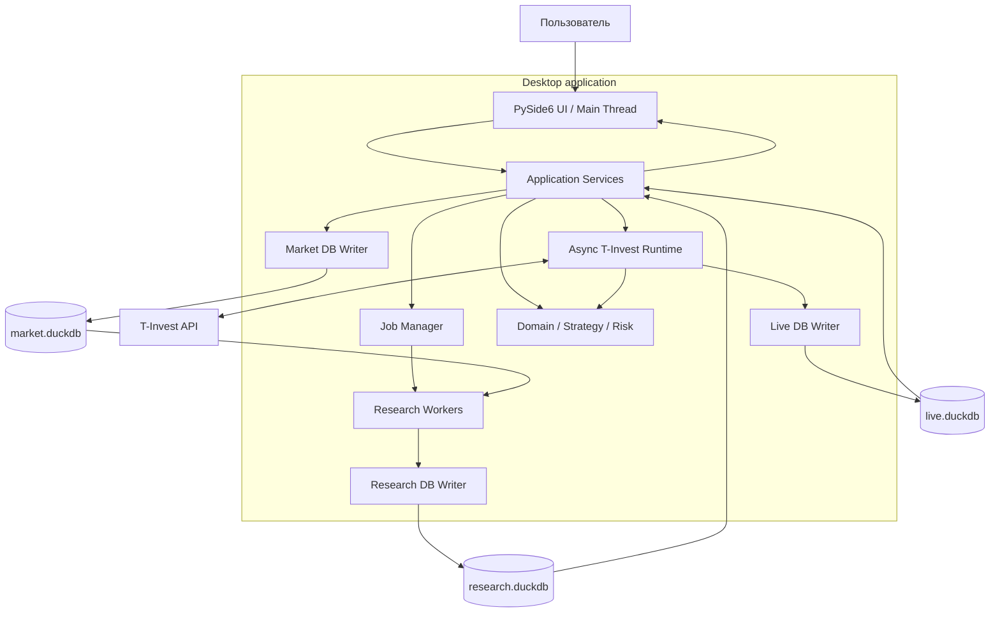

# 01. Desktop GUI

## 1. Обязательное требование

Система является **desktop-приложением с полноценным графическим интерфейсом**.

Для пользовательской работы не используются:

- браузер;
- Electron;
- web frontend;
- FastAPI/Flask/Django;
- REST API между GUI и ядром;
- локальный HTTP-сервер на `localhost`;
- web-dashboard как основной интерфейс.

Сеть используется только там, где она действительно нужна приложению: для подключения к внешнему API T‑Инвестиций.

Все пользовательские сценарии должны выполняться из GUI. CLI допускается только как developer/admin interface для автоматических тестов, диагностики, migration scripts и воспроизводимости экспериментов.

## 2. Предлагаемый desktop stack

Базовый вариант MVP:

- **PySide6 / Qt 6** — окна, формы, таблицы, диалоги, system tray при необходимости;
- Qt Model/View — большие таблицы без копирования всего dataset в UI;
- Qt Graphics / PyQtGraph — интерактивные графики свечей, equity curve, drawdown и optimization plots;
- Python application/domain layer — общая бизнес-логика;
- DuckDB — локальное хранилище;
- Polars/Arrow — batch analytics;
- `multiprocessing` — тяжелые backtest/optimization jobs;
- отдельный asyncio runtime — T‑Invest streams и live execution;
- OS keychain через Python `keyring` — хранение API token.

PySide6 выбран потому, что приложение и торговое ядро остаются в одном Python ecosystem и нет необходимости вводить отдельный frontend/backend protocol.

## 3. Архитектура desktop-приложения



### Главное правило

**UI thread никогда не выполняет тяжелую работу.**

В UI thread разрешены только:

- отрисовка;
- обработка пользовательских действий;
- легкая валидация форм;
- отображение уже подготовленных данных;
- отправка команд в application layer.

Backfill, aggregation, backtest, optimization, validation и сетевые stream handlers выполняются вне UI thread.

## 4. Execution model

### UI main thread

Содержит:

- `QApplication`;
- окна и dialogs;
- view models / Qt models;
- progress/status representation;
- dispatch пользовательских команд.

### Async network runtime

Отдельный runtime обслуживает:

- MarketDataStream;
- order/trades stream;
- reconnect;
- heartbeat;
- portfolio/positions queries;
- отправку заявок.

Он не должен напрямую менять widgets. Состояние передается в GUI через thread-safe events/signals.

### Research worker pool

CPU-heavy задачи выполняются через multiprocessing:

- feature calculation;
- backtests;
- Optuna trials;
- walk-forward folds;
- stress validation.

Worker возвращает компактный `JobResult`; запись в `research.duckdb` выполняет coordinator/single writer.

## 5. Основные экраны

### 5.1 Dashboard

При запуске пользователь сразу видит:

- режим приложения: `RESEARCH`, `SANDBOX`, `PRODUCTION`;
- подключение к T‑Invest;
- состояние трех DuckDB;
- последний timestamp market data по каждой акции;
- активные jobs;
- approved strategy configs;
- открытые позиции;
- активные заявки;
- realized/unrealized PnL;
- состояние risk/circuit breakers;
- последние критические события.

Режим `PRODUCTION` визуально должен однозначно отличаться от research/sandbox.

### 5.2 Instruments & Data

Функции:

- выбор universe из ~10 акций;
- sync instruments;
- состояние 5-летней истории;
- coverage по каждому инструменту;
- количество 1m свечей;
- min/max timestamp;
- неизвестные gaps;
- запуск/остановка/resume backfill;
- запуск data-quality validation;
- построение агрегированных timeframe;
- просмотр нескольких последних свечей и найденных проблем.

Backfill отображается как background job с progress по инструментам и временным диапазонам.

### 5.3 Chart Explorer

Интерактивный экран для проверки данных и поведения стратегии:

- instrument;
- timeframe;
- date range;
- candlestick chart;
- volume;
- EMA/другие используемые features;
- entry/exit markers;
- stop/trailing levels;
- zoom/pan;
- переход к конкретной сделке из backtest report.

UI не должен пытаться отрисовать все 5 лет 1m свечей одновременно. Range выбирается запросом, а данные для длинных периодов downsample/aggregate до разумного числа points.

### 5.4 Backtest

Пользователь задает:

- инструменты;
- timeframe;
- период;
- strategy config;
- модель комиссий/проскальзывания;
- initial capital / sizing settings.

После запуска показываются:

- progress;
- aggregate metrics;
- metrics по инструментам;
- equity curve;
- drawdown;
- trade ledger;
- распределение сделок;
- переход к сделке на Chart Explorer.

### 5.5 Optimization

Пользователь задает search space и ограничения, но final holdout здесь **не виден optimizer-у**.

Экран показывает:

- running/completed/rejected trials;
- progress по folds/instruments;
- лучшие не по одной доходности, а по stability objective;
- neighbor robustness;
- temporal stability;
- cross-instrument metrics;
- Pareto candidates;
- причины rejection.

GUI должен явно разделять `candidate` и `approved` — лучший trial автоматически не становится торговой стратегией.

### 5.6 Validation

На этом экране пользователь выбирает frozen candidate и запускает final holdout validation.

Отображаются:

- параметры frozen config;
- holdout interval;
- pass/fail gates;
- stress costs;
- per-instrument metrics;
- aggregate metrics;
- sensitivity results;
- итоговый статус `APPROVED` / `REJECTED`.

После начала final validation параметры config неизменяемы.

### 5.7 Strategy Registry

Список всех сохраненных конфигураций `GrowthTrendV1`:

```text
DRAFT
CANDIDATE
VALIDATING
APPROVED_SANDBOX
APPROVED_PROD
REJECTED
DISABLED
```

Для каждой конфигурации доступны:

- параметры;
- source experiment;
- validation report;
- дата создания;
- code/data versions;
- разрешенные инструменты;
- разрешенный mode;
- history запусков.

### 5.8 Trading

Отдельный экран для `SANDBOX` и `PRODUCTION`.

Показывает в real time:

- connection health;
- subscribed instruments;
- текущий bar/feature state;
- latest strategy decisions;
- позиции;
- order intents;
- broker orders;
- fills;
- PnL;
- risk usage;
- reconciliation status;
- circuit breakers;
- event log.

Основные действия:

- Start Sandbox;
- Stop Sandbox;
- Start Production;
- Pause new entries;
- Cancel active orders;
- controlled shutdown;
- emergency stop.

`Start Production` должен требовать дополнительного подтверждения и показывать перед запуском конкретный strategy config, universe и risk limits.

## 6. Навигация

Рекомендуемая структура main window:

```text
┌──────────────────────────────────────────────────────┐
│ App mode │ T-Invest status │ Active job │ Risk state│
├───────────────┬──────────────────────────────────────┤
│ Dashboard     │                                      │
│ Data          │              Workspace               │
│ Charts        │                                      │
│ Backtest      │                                      │
│ Optimization  │                                      │
│ Validation    │                                      │
│ Strategies    │                                      │
│ Trading       │                                      │
│ Logs          │                                      │
│ Settings      │                                      │
├───────────────┴──────────────────────────────────────┤
│ Status / progress / latest important event           │
└──────────────────────────────────────────────────────┘
```

Один main window предпочтительнее большого количества независимых окон.

## 7. Job model

Любая длительная операция оформляется как `Job`:

```text
job_id
job_type
status
created_at
started_at
finished_at
progress_current
progress_total
message
can_cancel
error
result_ref
```

Статусы:

```text
QUEUED
RUNNING
CANCELLING
CANCELLED
COMPLETED
FAILED
```

Типы jobs первой версии:

- `INSTRUMENT_SYNC`;
- `HISTORICAL_BACKFILL`;
- `DATA_VALIDATION`;
- `BAR_AGGREGATION`;
- `BACKTEST`;
- `OPTIMIZATION`;
- `FINAL_VALIDATION`;
- `EXPORT_REPORT`.

UI должен оставаться полностью responsive во время job.

## 8. Cancel semantics

Cancel не означает убийство процесса в произвольной точке.

Каждая операция имеет safe cancellation points:

- backfill — между API chunks / DB transactions;
- aggregation — между instruments/time ranges;
- backtest — между instruments/folds;
- optimization — запрет новых trials + завершение/остановка текущих по policy;
- validation — аналогично backtest.

Для live trading вместо обычного cancel используются отдельные controlled actions.

## 9. Desktop state и настройки

### В DuckDB

Хранятся только данные предметной области и результаты исследований/торгов.

### В application settings

Локально хранятся:

- размер/позиция окна;
- последний открытый экран;
- выбранные display preferences;
- пути к data directory;
- non-secret UI preferences.

Для этого достаточно `QSettings`.

### Секреты

T‑Invest token:

- не хранится в DuckDB;
- не хранится в YAML/TOML;
- не логируется;
- сохраняется через OS credential/keychain storage;
- может быть введен пользователем только на текущую сессию.

## 10. Работа при закрытии приложения

MVP **не содержит отдельного headless daemon/service**.

Следовательно:

- если desktop application полностью закрыт, стратегия больше не принимает новые решения;
- перед завершением приложения live mode обязан пройти controlled shutdown;
- приложение проверяет active orders и positions;
- политика `cancel orders on shutdown` задается явно;
- наличие открытой позиции блокирует «тихий» выход и показывает пользователю состояние;
- аварийное завершение восстанавливается через reconciliation при следующем запуске.

Позже можно добавить отдельный background service, но это будет отдельное архитектурное решение и не входит в текущий scope.

## 11. Safety UX

Для торгового desktop UI обязательны:

- четкий индикатор `SANDBOX` / `PRODUCTION`;
- production actions нельзя запускать случайным двойным кликом;
- destructive actions требуют подтверждения;
- UI никогда не скрывает broker/local mismatch;
- stale data визуально выделяется и блокирует новые entry orders;
- при срабатывании circuit breaker экран показывает причину и необходимое действие;
- кнопка emergency stop всегда доступна на Trading screen;
- статус действия показывается по подтвержденному broker state, а не только по факту нажатия кнопки.

## 12. Отчеты

Все отчеты должны быть доступны непосредственно в desktop UI.

Дополнительно пользователь может экспортировать результаты в локальные файлы:

- CSV — trades/metrics;
- Parquet — большие табличные выборки;
- Markdown — experiment/validation summary;
- PNG/SVG — отдельные графики при необходимости.

Экспорт не требует web-сервиса.

## 13. Packaging

Цель релиза — обычное устанавливаемое desktop application.

Минимальные требования:

- запуск без установленного пользователем Python;
- versioned application builds;
- локальная data directory вне каталога бинарника;
- migration DuckDB при запуске новой версии;
- диагностический log bundle по запросу пользователя;
- обновление приложения не удаляет `.duckdb` и пользовательские настройки.

Для MVP packaging можно реализовать через PyInstaller или Nuitka после стабилизации Python entrypoint.

## 14. Definition of Done GUI

Desktop layer считается базово готовым, когда:

1. пользователь может пройти `data → backtest → optimization → validation → sandbox` без CLI;
2. ни одна тяжелая задача не блокирует UI thread;
3. ошибки jobs отображаются в интерфейсе с понятной причиной;
4. приложение корректно восстанавливает состояние после restart;
5. production mode имеет отдельные safety confirmations;
6. API token не сохраняется в plaintext;
7. desktop-приложение не поднимает HTTP/web server;
8. закрытие приложения при активной торговле проходит controlled shutdown.