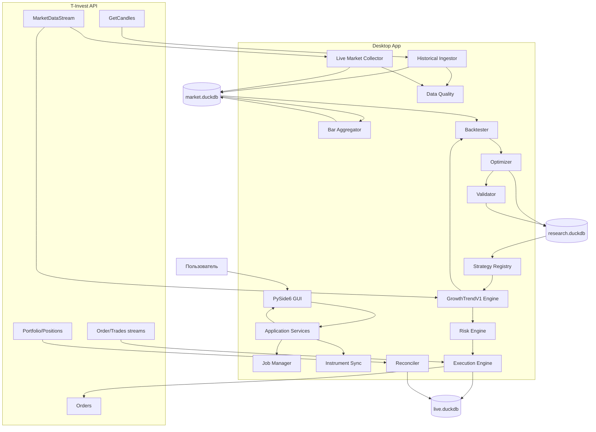

# 02. Архитектура

## 1. Архитектурный стиль

Для первой версии используется **модульный монолит**.

Scope MVP:

- один алгоритм `GrowthTrendV1`;
- около 10 акций;
- 5 лет минутной истории;
- локальный research/backtest;
- один live-runner;
- полноценный **PySide6 desktop GUI**;
- никакого web frontend или локального HTTP API;
- DuckDB как единственная DB-технология.

Микросервисы, отдельный сервер БД и web backend для этого масштаба не нужны. Главная задача архитектуры — обеспечить воспроизводимость данных, одинаковое поведение strategy core в backtest/live и безопасное управление всем pipeline из desktop GUI.

## 2. Компоненты



GUI и application layer находятся в одном desktop application. Между ними нет REST/HTTP/WebSocket API. Тяжелые задачи выполняются worker-процессами, а сетевой live-runtime работает вне UI thread.

## 3. Почему несколько DuckDB-файлов

DuckDB отлично подходит для локальной аналитики, но архитектуру не нужно строить как серверную OLTP-БД с десятками независимых writers.

Поэтому данные делятся по назначению:

### `market.duckdb`

Содержит:

- instruments;
- trading calendars/session metadata;
- canonical candles 1m;
- materialized aggregated candles;
- ingestion status;
- data quality results;
- dataset versions.

Writer: `data-worker`.

Research и optimizer открывают базу преимущественно read-only.

### `research.duckdb`

Содержит:

- experiment runs;
- Optuna/trial results;
- fold metrics;
- validation results;
- strategy configurations;
- promotion status.

Writer: research coordinator.

Если Optuna запускается параллельно в нескольких worker-процессах, они не должны хаотично писать в один DuckDB-файл. Worker возвращает result coordinator-у, а coordinator сериализует запись.

### `live.duckdb`

Содержит небольшой operational state:

- decisions;
- order intents;
- broker orders;
- fills;
- positions;
- reconciliation events;
- runtime checkpoints;
- circuit breaker events.

Writer: один `live-runner`.

Объем live-данных мал, поэтому здесь важнее надежное восстановление state, чем скорость аналитических запросов.

## 4. Главный принцип: pure strategy core

Стратегия не должна напрямую знать о T‑Invest API, DuckDB, SQL или сети.

```python
class Strategy:
    def on_bar(self, state: StrategyState, bar: Bar, features: Features) -> Decision:
        ...
```

`Decision` описывает намерение:

- `HOLD`
- `ENTER_LONG`
- `EXIT_LONG`

Execution layer превращает решение в конкретную заявку. Поэтому одна и та же реализация `GrowthTrendV1` используется в backtest, validation, sandbox и production.

## 5. Разделение domain / adapters

### Domain

Не зависит от SDK брокера и storage:

- `Bar`
- `Instrument`
- `Signal`
- `Decision`
- `Position`
- `OrderIntent`
- `Fill`
- `StrategyConfig`
- risk rules
- strategy rules

### Adapters

- `TInvestMarketDataClient`
- `TInvestOrdersClient`
- `TInvestPortfolioClient`
- `DuckDBMarketRepository`
- `DuckDBResearchRepository`
- `DuckDBLiveRepository`
- clock / scheduler

## 6. Процессы приложения

### `data-worker`

Один процесс-владелец `market.duckdb`.

Задачи:

- instrument sync;
- historical backfill;
- incremental gap fill;
- прием закрытых live candles;
- data quality;
- построение старших таймфреймов.

### `desktop-app`

Основная пользовательская точка входа. Из GUI доступны:

- загрузка/проверка данных;
- aggregation;
- backtest;
- optimization;
- final validation;
- strategy registry;
- sandbox/prod trading;
- monitoring и controlled shutdown.

Для backtest диапазон данных желательно одним запросом читать из DuckDB в Arrow/Polars и дальше считать в памяти. Не следует выполнять SQL-запрос на каждый бар.

### `developer-cli`

CLI сохраняется только для development/CI/diagnostics и воспроизводимости. Пользователю он не требуется. Команды CLI должны вызывать те же application services, что и GUI, а не отдельную реализацию логики.

### `optimizer`

Для ~10 акций имеет смысл параллелить **trials/folds в CPU**, но не DB writes.

Паттерн:

```text
coordinator
    ├── loads/caches required market data
    ├── dispatches trial jobs
    ├── receives trial results
    └── serially writes results to research.duckdb
```

### `live-runner`

Один процесс может управлять всеми ~10 инструментами и несколькими strategy instances одной версии стратегии.

Задачи:

- market stream;
- warmup;
- signal calculation;
- pre-trade checks;
- order lifecycle;
- position reconciliation;
- circuit breakers;
- serial writes в `live.duckdb`.

## 7. Слои проекта

```text
PySide6 UI                Developer CLI
      \                    /
       └── Application services / use cases
                    ↓
        Domain strategy + risk + models
                    ↓
             Ports (interfaces)
                    ↓
       Adapters: T-Invest / DuckDB / OS
```

UI не содержит SQL, broker calls или strategy logic. View/ViewModel инициирует use case и отображает его state/result.

Dependency direction — только внутрь. `domain` ничего не импортирует из `adapters`.

## 8. Data path для backtest

Предпочтительный путь:

```text
DuckDB SQL range scan
    → Arrow / Polars DataFrame
    → feature calculation
    → strategy simulation
    → metrics/trades
    → one result write
```

Антипаттерн:

```text
for each bar:
    SELECT ... FROM duckdb
```

## 9. Синхронность и UI responsiveness

Qt main thread используется только для GUI. Любая операция, которая может занять заметное время, выполняется асинхронно относительно UI.

Research pipeline использует multiprocessing для CPU-heavy workloads. Coordinator передает в UI progress/events, но workers не работают с widgets.

`live-runner` строится на отдельном `asyncio` runtime, так как одновременно нужны:

- market stream;
- order stream;
- periodic reconciliation;
- heartbeat;
- control loop.

Нельзя выполнять тяжелую оптимизацию внутри live-процесса или UI thread. Сетевые callbacks также не должны напрямую менять Qt widgets — только публиковать thread-safe events/signals.

## 10. Backup и reproducibility

Перед важной optimization/validation серией создается dataset snapshot metadata:

- диапазон дат;
- список instrument UID;
- row counts;
- min/max timestamps;
- data-quality status;
- ingestion version;
- aggregation version;
- content/checksum metadata, где применимо.

Не обязательно копировать весь `market.duckdb` на каждый experiment. Достаточно заморозить dataset definition и гарантировать, что исторические canonical 1m строки не изменяются без новой версии dataset.

Для резервного копирования можно периодически копировать закрытый DuckDB-файл или экспортировать immutable historical partitions в Parquet.

## 11. Когда DuckDB перестанет быть достаточным

Возвращаться к серверной БД стоит только при появлении реальной потребности, например:

- несколько независимых live writers;
- много одновременно работающих сервисов;
- централизованный multi-user research server;
- сотни/тысячи инструментов и постоянный ingestion;
- необходимость HA/replication;
- удаленный доступ нескольких машин к одной operational DB.

До появления таких требований DuckDB остается предпочтительным вариантом для текущего scope.


## 12. Desktop lifecycle

В MVP торговый runtime является частью desktop application: отдельного web/backend service или headless daemon нет.

При закрытии приложения:

1. запрещаются новые strategy entries;
2. завершается/отменяется допустимая background activity;
3. проверяются активные broker orders;
4. выполняется reconciliation positions/orders;
5. runtime state flush-ится в `live.duckdb`;
6. сетевые streams закрываются;
7. только после этого завершается UI.

Если есть открытые позиции или неопределенное состояние заявки, приложение не должно выполнять тихий выход без предупреждения.

Подробности GUI: `docs/01-desktop-ui.md`.